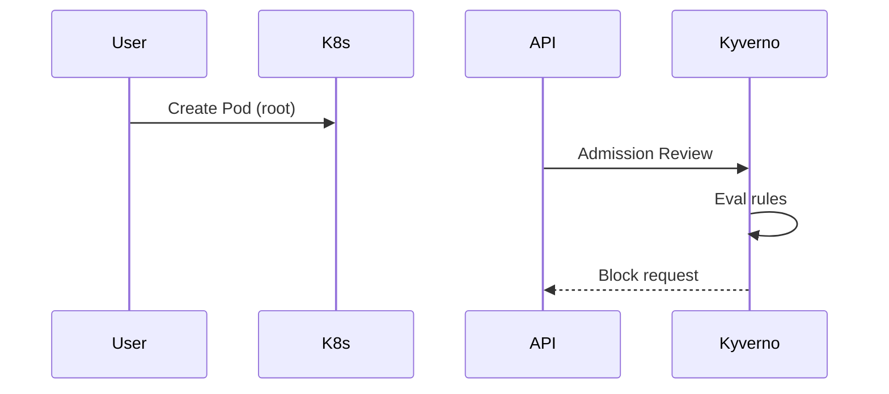

# Architecture: Policy-as-Code with Kyverno
> Maturity: Lab / Reference Implementation

## System Diagram
The following Mermaid.js sequence diagram maps the core workflow and interactions:

## The Admission Controller Lifecycle
Kyverno integrates directly with the Kubernetes API server via a `ValidatingWebhookConfiguration` and a `MutatingWebhookConfiguration`.

When an API request (e.g., `kubectl apply -f deployment.yaml`) is received:
1. **Authentication/Authorization**: Standard K8s RBAC checks occur.
2. **Mutation**: Kyverno's mutating webhooks intercept the request. If a policy dictates (e.g., "inject a sidecar proxy"), Kyverno modifies the JSON payload on the fly.
3. **Object Schema Validation**: K8s ensures the YAML is syntactically valid.
4. **Validation**: Kyverno's validating webhooks intercept the request. It evaluates rules like `disallow-privileged`. If the evaluation fails, the API server rejects the request with HTTP 403 Forbidden and the policy's custom error message.

## GitOps Integration
By storing policies in Git and deploying them via Argo CD, we achieve a centralized, auditable, and version-controlled security posture. Security teams can review PRs modifying the policies, ensuring no backdoors are introduced into the cluster's admission control.
